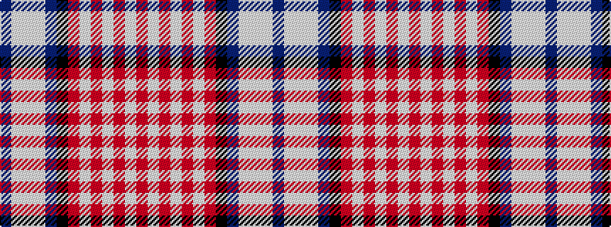

BWWWBKRWRWRWR

It is a 13 stripe tartan.

<figure class="pat-woven">

<figcaption>idealised sample</figcaption>
</figure>

## Colour Sequence



## Tartans with this colour sequence

This pattern is a design lineage: every tartan below shares one colour order, whatever its owner —
near-identical designs are grouped, the largest lineage first (#112: the pattern is a tartan's
second parent, beside its family or clan).

<table class="sett-table">
<tbody>
<tr><td><a href="/variants/s13/db14lb2w2lb2db20k20r17w4r3w3r3w3r5~x2/">American Bi-Centennial</a></td></tr>
<tr><td class="sett-swatch"></td></tr>
<tr><td><a href="/variants/s13/db15lb2w8lb2db42k42r42w8r4w4r4w4r10~x2/">American St Andrews Societies</a></td></tr>
<tr><td class="sett-swatch"></td></tr>
</tbody>
</table>

