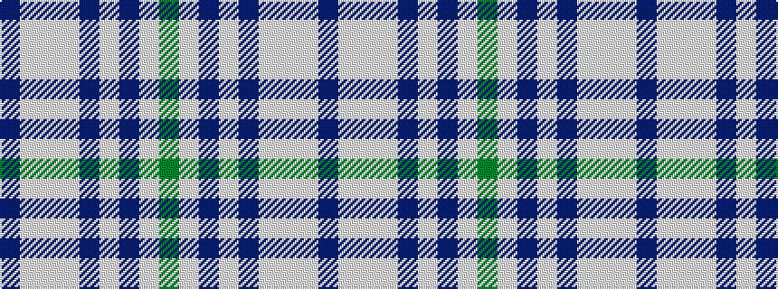

BWWWBWBWG

It is a 9 stripe tartan.

<figure class="pat-woven">

<figcaption>idealised sample</figcaption>
</figure>

## Colour Sequence



## Tartans with this colour sequence

This pattern is a design lineage: every tartan below shares one colour order, whatever its owner —
near-identical designs are grouped, the largest lineage first (#112: the pattern is a tartan's
second parent, beside its family or clan).

<table class="sett-table">
<tbody>
<tr><td><a href="/variants/s9/db4w3lb28w3dp16w4dp8lp46g4/">Heather (R.S.S.P.C.C.) Corporate Tartan</a></td></tr>
<tr><td class="sett-swatch"></td></tr>
<tr class="cluster-sep"><td></td></tr>
<tr><td><a href="/variants/s9/g4lp46dp8w4dp16w3lb28w3b4~lp3004302-lb3200000/">Heather, (R.S.S.P.C.C.)</a></td></tr>
<tr><td class="sett-swatch"></td></tr>
</tbody>
</table>

