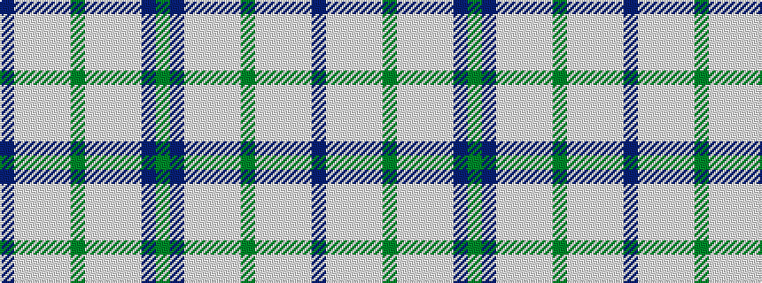

BWWWWGWWWWBG

It is a 12 stripe tartan.

<figure class="pat-woven">

<figcaption>idealised sample</figcaption>
</figure>

## Colour Sequence



## Tartans with this colour sequence

| Tartans |
|---------------|
| [Highlands Country Club](/setts/s12/db15lbi11lb2lbi1lb1g4lb1lbi1lb2lbi11db15g5~x4/)|
||
