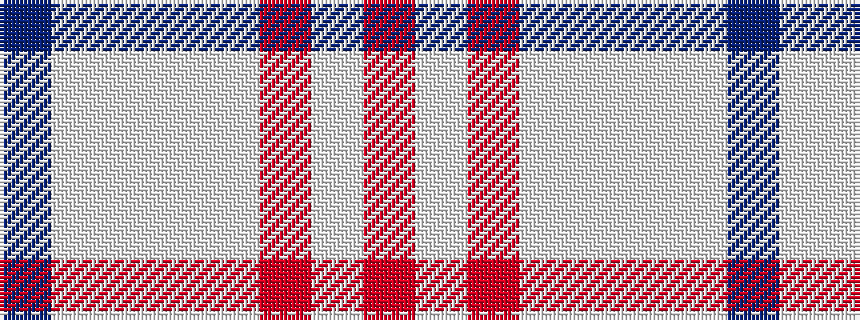

BWWWWRWR

It is a 8 stripe tartan.

<figure class="pat-woven">

<figcaption>idealised sample</figcaption>
</figure>

## Colour Sequence



## Tartans with this colour sequence

| Tartans |
|---------------|
| [Malmo Skyblue](/setts/s8/dt28w36w28w36w85r3w3r3/)|
||
