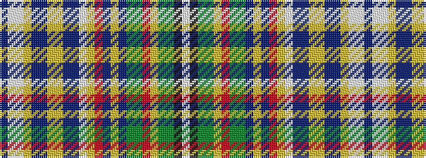

BWWYBBYYBBWYRBYBGGRYGGKW

It is a 24 stripe tartan.

<figure class="pat-woven">

<figcaption>idealised sample</figcaption>
</figure>

## Colour Sequence



## Tartans with this colour sequence

| Tartans |
|---------------|
| [Knox #1](/variants/s24/db10lbi3lb2lo2db18db3lo2lo4db18db13lbi2lo2r11dt12lo2dp2g2g13r2lo4g4g3k2lb10~x2/)|
||
