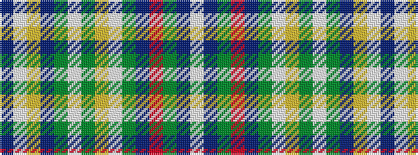

BWYBGWGYWGBRGBW

It is a 15 stripe tartan.

<figure class="pat-woven">

<figcaption>idealised sample</figcaption>
</figure>

## Colour Sequence



## Tartans with this colour sequence

| Tartans |
|---------------|
| [Thomas McGurran](/setts/s15/db4w8lo3db1dg1w1dg32lo2w1dg1n8r1dg2n2w2~x2/)|
||
