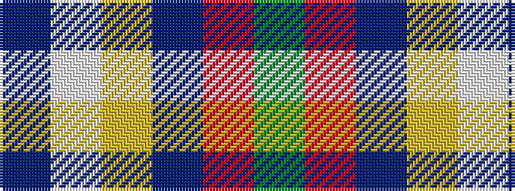

BWYBRG

It is a 6 stripe tartan.

<figure class="pat-woven">

<figcaption>idealised sample</figcaption>
</figure>

## Colour Sequence



## Tartans with this colour sequence

| Tartans |
|---------------|
| [Montessori School of Denver](/setts/s6/g25r9b3ly7w3dp11/)|
||
| [Montessori School of Denver (School)](/setts/s6/g25r9t3ly7w3n11~x3/)|
||
