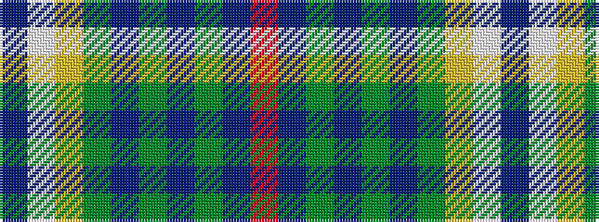

BWYGBGBGBR

It is a 10 stripe tartan.

<figure class="pat-woven">

<figcaption>idealised sample</figcaption>
</figure>

## Colour Sequence



## Tartans with this colour sequence

| Tartans |
|---------------|
| [Chisholm Colonial](/setts/s10/dt6w1lo24g6n3g1n3g1n12r1~x2/)|
||
