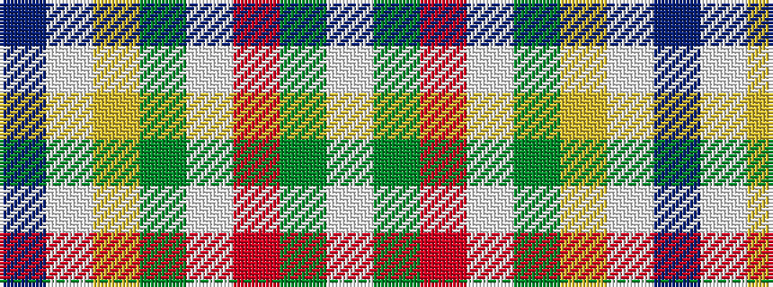

BWYGWRGW

It is a 8 stripe tartan.

<figure class="pat-woven">

<figcaption>idealised sample</figcaption>
</figure>

## Colour Sequence



## Tartans with this colour sequence

| Tartans |
|---------------|
| [Victorian Highland Pipe Band Association (Australia)](/setts/s8/dt46w1lo3dg13w1r7g3w1~x2/)|
||
