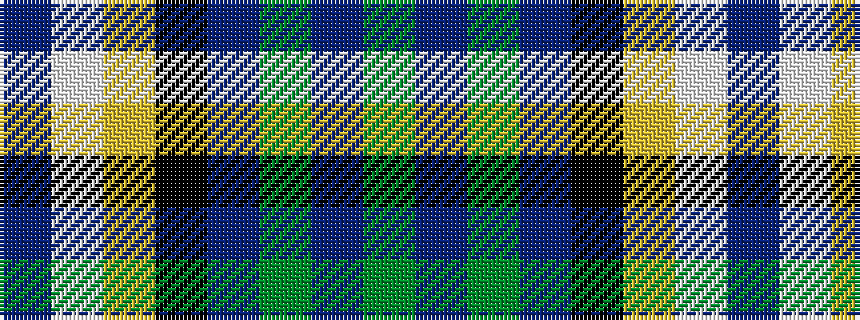

BWYKBGBG

It is a 8 stripe tartan.

<figure class="pat-woven">

<figcaption>idealised sample</figcaption>
</figure>

## Colour Sequence



## Tartans with this colour sequence

| Tartans |
|---------------|
| [Alexander of Menstry Dress](/setts/s8/db5w30lr9k9dp9g2dp2g5~x2/)|
||
