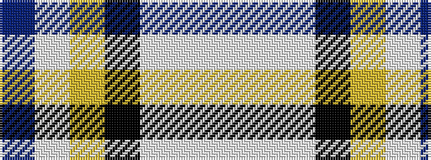

BWYKWWW

It is a 7 stripe tartan.

<figure class="pat-woven">

<figcaption>idealised sample</figcaption>
</figure>

## Colour Sequence



## Tartans with this colour sequence

| Tartans |
|---------------|
| [Nunavut Territory (District)](/variants/s7/db60w1ly4k4w1lp8w2~x2/)|
||
