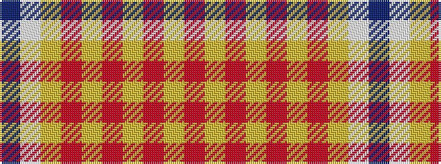

BWYRYRYRYR

It is a 10 stripe tartan.

<figure class="pat-woven">

<figcaption>idealised sample</figcaption>
</figure>

## Colour Sequence



## Tartans with this colour sequence

| Tartans |
|---------------|
| [Virginia Tech](/variants/s10/r6lo2r32lo15r2lo3r2lo6w3db4~x2/)|
||
| [Virginia Tech (Corporate)](/variants/s10/r6lo2r36lo18r2lo4r2lo6w3db4~x2/)|
||
