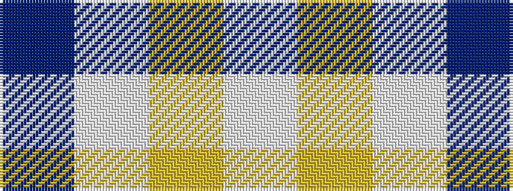

BWYW

It is a 4 stripe tartan.

<figure class="pat-woven">

<figcaption>idealised sample</figcaption>
</figure>

## Colour Sequence



## Tartans with this colour sequence

| Tartans |
|---------------|
| [Weir Minerals (Corporate)](/setts/s4/db80w1lo8w3~x2/)|
||
