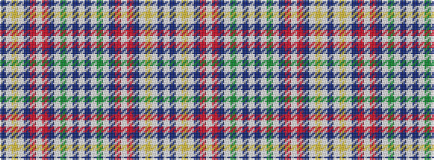

BWYWBRWRBWGWBWBWGWBRWRBWYWBW

It is a 28 stripe tartan.

<figure class="pat-woven">

<figcaption>idealised sample</figcaption>
</figure>

## Colour Sequence



## Tartans with this colour sequence

| Tartans |
|---------------|
| [Wombles #4](/variants/s28/w5db2w1g8w1db2m2w1m2db2w1lo8w1db2w5~x4/)|
||
