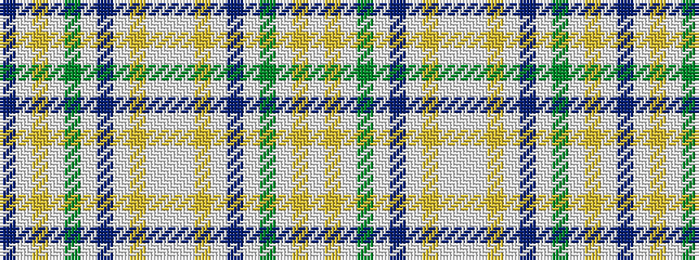

BWYWGWBWYWWWYWBWGWYW

It is a 20 stripe tartan.

<figure class="pat-woven">

<figcaption>idealised sample</figcaption>
</figure>

## Colour Sequence



## Tartans with this colour sequence

| Tartans |
|---------------|
| [Unidentified Scarlett #4](/setts/s20/dp3w2lo8w10g8w10dp4w40lo8w2lb3~x2/)|
||
