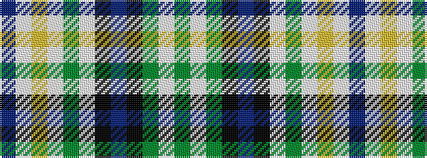

BWYWGWKBKGWG

It is a 12 stripe tartan.

<figure class="pat-woven">

<figcaption>idealised sample</figcaption>
</figure>

## Colour Sequence



## Tartans with this colour sequence

| Tartans |
|---------------|
| [Womack (2014)](/variants/s12/dg19w2dg5k4db21k4w2dg5w1ly1w1do14~x2/)|
||
| [Womack (2014)](/variants/s12/dg19w2dg5k4db21k4w2dg5w1ly1w1dr14~x2/)|
||
