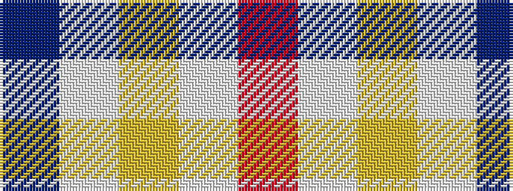

BWYWR

It is a 5 stripe tartan.

<figure class="pat-woven">

<figcaption>idealised sample</figcaption>
</figure>

## Colour Sequence



## Tartans with this colour sequence

| Tartans |
|---------------|
| [Philippine Heritage](/variants/s5/db30w4lo1w4r30~x4/)|
||
| [Philippine Heritage (Corporate)](/variants/s5/db30w4ly1w4r30~x4/)|
||
