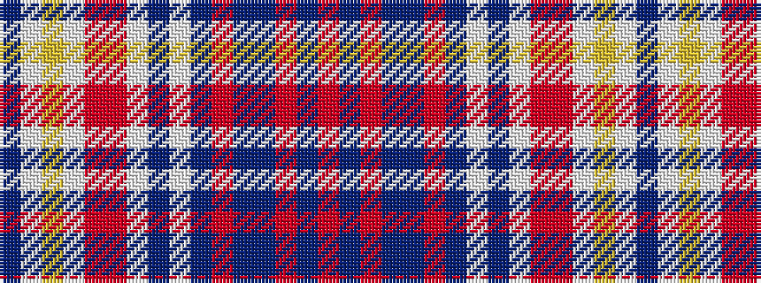

BWYWRRWBWBRBBRBR

It is a 16 stripe tartan.

<figure class="pat-woven">

<figcaption>idealised sample</figcaption>
</figure>

## Colour Sequence



## Tartans with this colour sequence

| Tartans |
|---------------|
| [Wcwm 1717](/setts/s16/do20lb1lo8lb1r16ri4lb1do18lb1do20ri8do8b8r8b8r1~x4/)|
||
