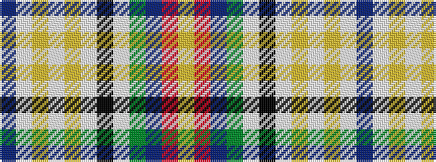

BWYWYWKWGBRY

It is a 12 stripe tartan.

<figure class="pat-woven">

<figcaption>idealised sample</figcaption>
</figure>

## Colour Sequence



## Tartans with this colour sequence

| Tartans |
|---------------|
| [Robitaille, Jean-Francois (Personal)](/setts/s12/db21w2lo3w2lo2w2k12w2g6db15r2ly4~x2/)|
||
