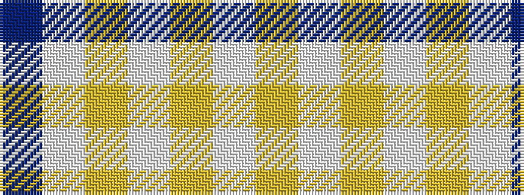

BWYWYWY

It is a 7 stripe tartan.

<figure class="pat-woven">

<figcaption>idealised sample</figcaption>
</figure>

## Colour Sequence



## Tartans with this colour sequence

| Tartans |
|---------------|
| [Argentine Flag](/variants/s7/t26w2ly1w3ly2w3ly4~x2/)|
||
