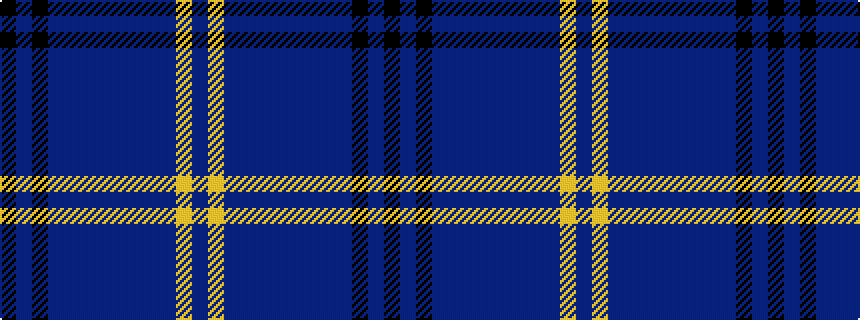

BYBBBBBBBBKBK

It is a 13 stripe tartan.

<figure class="pat-woven">

<figcaption>idealised sample</figcaption>
</figure>

## Colour Sequence



## Tartans with this colour sequence

| Tartans |
|---------------|
| [Institute of Directors (Scotland)](/variants/s13/dpi50lr4dpi12dp4dpi10dp8dpi4dp6dpi4dp10k12dp5k42/)|
||
