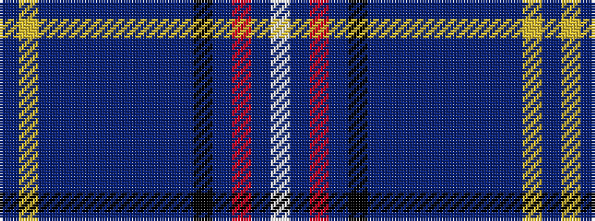

BYBBBBBBBBKBRBW

It is a 15 stripe tartan.

<figure class="pat-woven">

<figcaption>idealised sample</figcaption>
</figure>

## Colour Sequence



## Tartans with this colour sequence

| Tartans |
|---------------|
| [MatchPoint](/setts/s15/db6ly2dbi24db4dbi8db6dbi6db8dbi3db10k14db4r3db34w4/)|
||
