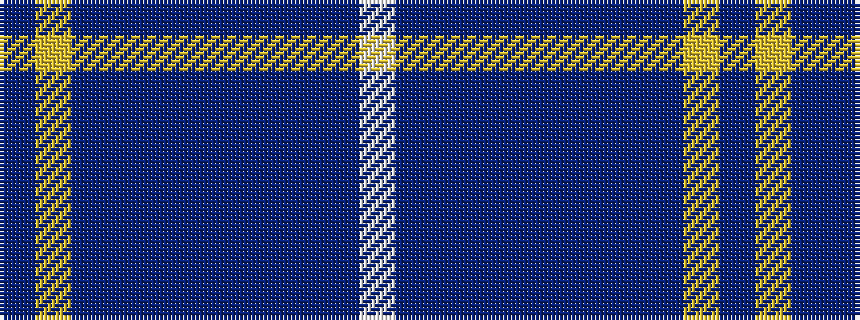

BYBBBBBBBBW

It is a 11 stripe tartan.

<figure class="pat-woven">

<figcaption>idealised sample</figcaption>
</figure>

## Colour Sequence



## Tartans with this colour sequence

| Tartans |
|---------------|
| [Hubbard Foundation of Scotland (Corp](/setts/s11/db4ly3dt16db14dbi3db14dbi3dt4dbi3dt8w2~x2/)|
||
