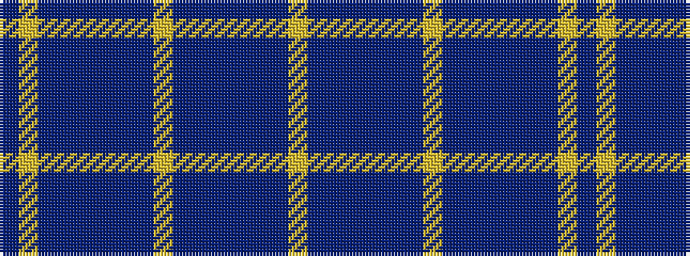

BYBBBBBBYBBBBBBY

It is a 16 stripe tartan.

<figure class="pat-woven">

<figcaption>idealised sample</figcaption>
</figure>

## Colour Sequence



## Tartans with this colour sequence

| Tartans |
|---------------|
| [Orlando Police Department](/setts/s16/db12ly1t16db1t1db14t3db14ly1~x4/)|
||
