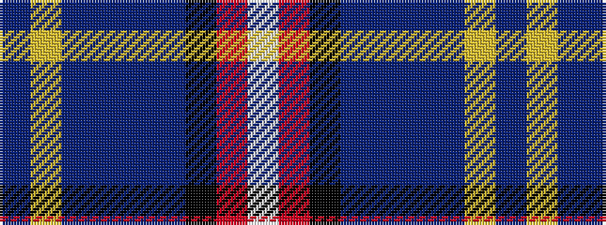

BYBBBBKRW

It is a 9 stripe tartan.

<figure class="pat-woven">

<figcaption>idealised sample</figcaption>
</figure>

## Colour Sequence



## Tartans with this colour sequence

| Tartans |
|---------------|
| [Wrens](/variants/s9/b16ly3b8db12b1db6k32r1w2~x2/)|
||
