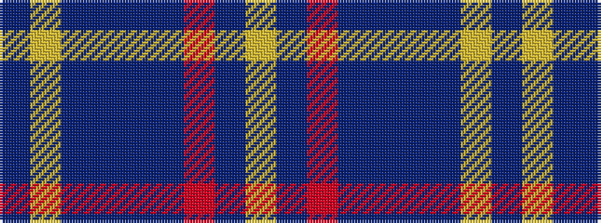

BYBBBBRBY

It is a 9 stripe tartan.

<figure class="pat-woven">

<figcaption>idealised sample</figcaption>
</figure>

## Colour Sequence



## Tartans with this colour sequence

| Tartans |
|---------------|
| [Calum's Cabin](/setts/s9/db32ly4db12db2db4db2o16db67ly6/)|
||
