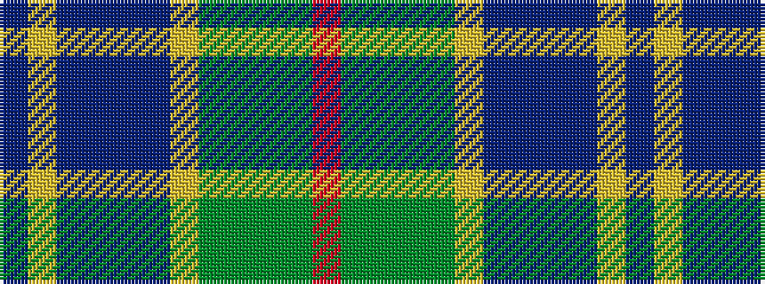

BYBBBBYGGGGR

It is a 12 stripe tartan.

<figure class="pat-woven">

<figcaption>idealised sample</figcaption>
</figure>

## Colour Sequence



## Tartans with this colour sequence

| Tartans |
|---------------|
| [State Seal of Montana (Fashion)](/setts/s12/db4lo4db26b5db5b8lo10g8dg5g5dg22o3~x2/)|
||
