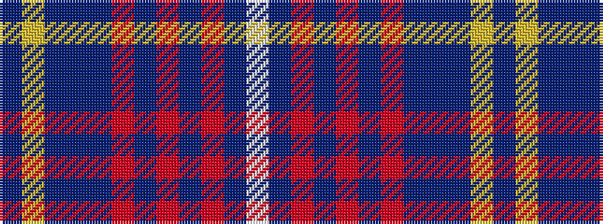

BYBBBRBRBRBW

It is a 12 stripe tartan.

<figure class="pat-woven">

<figcaption>idealised sample</figcaption>
</figure>

## Colour Sequence



## Tartans with this colour sequence

| Tartans |
|---------------|
| [Philadelphia Police and Fire Pipes and Drums](/setts/s12/db9ly4db4b41db4r4b4r15b4r4db41w4~x2/)|
||
