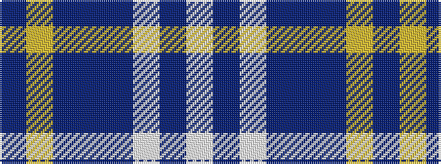

BYBBBWBW

It is a 8 stripe tartan.

<figure class="pat-woven">

<figcaption>idealised sample</figcaption>
</figure>

## Colour Sequence



## Tartans with this colour sequence

| Tartans |
|---------------|
| [PSN Test](/setts/s8/db25lo1db6b1db6lb4t3w1~x4/)|
||
