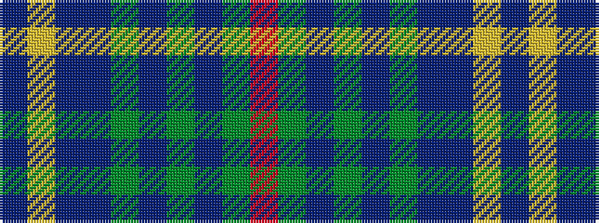

BYBBGBGBGR

It is a 10 stripe tartan.

<figure class="pat-woven">

<figcaption>idealised sample</figcaption>
</figure>

## Colour Sequence



## Tartans with this colour sequence

| Tartans |
|---------------|
| [Haines Family (Personal)](/variants/s10/r2y6t1y1t1y1t3dt8ly1b1~x4/)|
||
