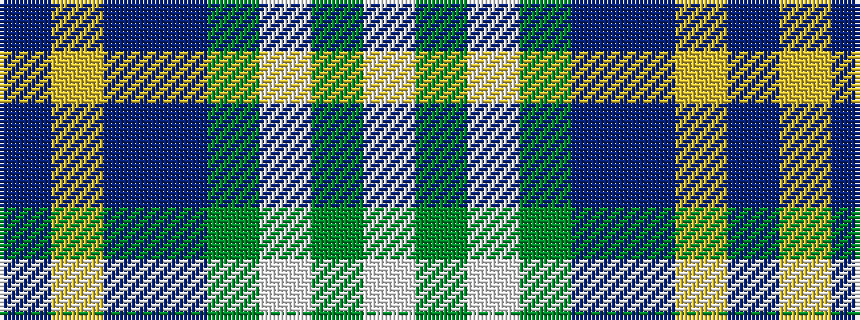

BYBBGWGW

It is a 8 stripe tartan.

<figure class="pat-woven">

<figcaption>idealised sample</figcaption>
</figure>

## Colour Sequence



## Tartans with this colour sequence

| Tartans |
|---------------|
| [Business Air](/setts/s8/b4ly2b16db15g16w3g3w4~x2/)|
||
