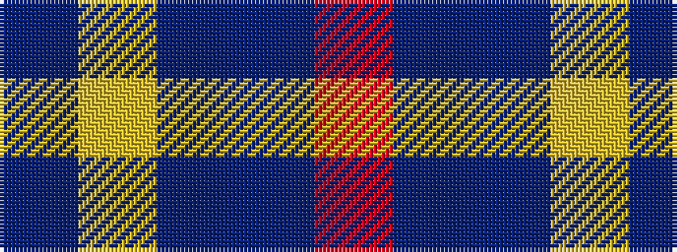

BYBBR

It is a 5 stripe tartan.

<figure class="pat-woven">

<figcaption>idealised sample</figcaption>
</figure>

## Colour Sequence



## Tartans with this colour sequence

| Tartans |
|---------------|
| [Brazell (Personal)](/variants/s5/db7ly1db7t11r2~x6/)|
||
| [Brazell (Personal)](/variants/s5/db7ly1db7b11r2~x6/)|
||
| [Tilburg (District)](/variants/s5/db9ly9db9t23r3~x2/)|
||
