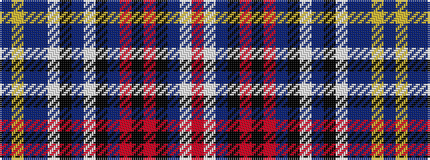

BYBBWKBWKBRKRKBWR

It is a 17 stripe tartan.

<figure class="pat-woven">

<figcaption>idealised sample</figcaption>
</figure>

## Colour Sequence



## Tartans with this colour sequence

| Tartans |
|---------------|
| [Clauweart](/setts/s17/db4lo2db4n6w2k2n6w2k2n13o3k4o3k8db6w2r4~x2/)|
||
