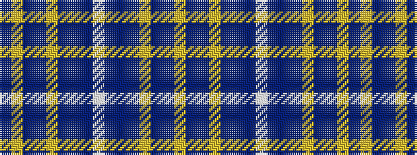

BYBBYBBBWBBBYBBY

It is a 16 stripe tartan.

<figure class="pat-woven">

<figcaption>idealised sample</figcaption>
</figure>

## Colour Sequence



## Tartans with this colour sequence

| Tartans |
|---------------|
| [Heirloom Blue Alba](/setts/s16/t4lo2t34db10lr4db4dp4db23w3~x2/)|
||
