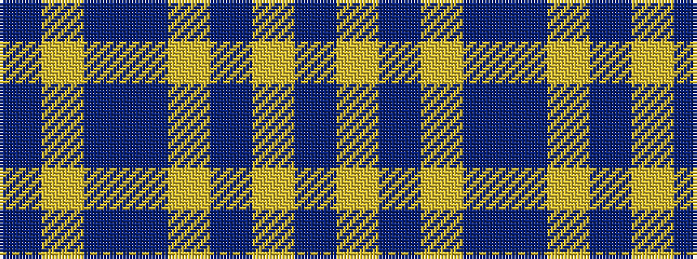

BYBBYBYB

It is a 8 stripe tartan.

<figure class="pat-woven">

<figcaption>idealised sample</figcaption>
</figure>

## Colour Sequence



## Tartans with this colour sequence

| Tartans |
|---------------|
| [Loughheed (Personal)](/variants/s8/dr3lo3dr4dr2lo18dr1lo2dr2~x4/)|
||
