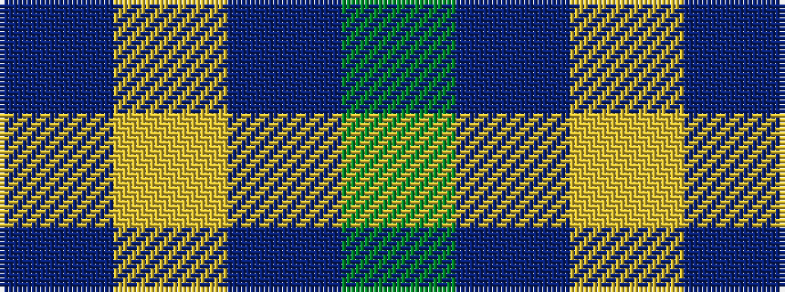

BYBG

It is a 4 stripe tartan.

<figure class="pat-woven">

<figcaption>idealised sample</figcaption>
</figure>

## Colour Sequence



## Tartans with this colour sequence

| Tartans |
|---------------|
| [Outlander #3](/variants/s4/y14n7lo6n2~x8/)|
||
| [Pasteur Fancy Tartan](/variants/s4/do10ly1do30y3~x4/)|
||
