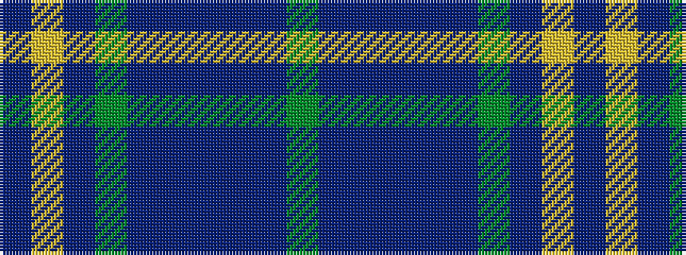

BYBGBBBBBG

It is a 10 stripe tartan.

<figure class="pat-woven">

<figcaption>idealised sample</figcaption>
</figure>

## Colour Sequence



## Tartans with this colour sequence

| Tartans |
|---------------|
| [Glasgow Cathedral](/setts/s10/g18dp3dbi10db2dbi10dp20g20dp3lo2dbi2~x2/)|
||
