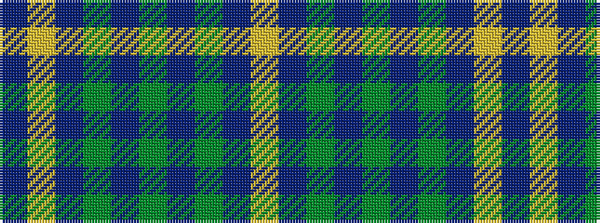

BYBGBGBGBY

It is a 10 stripe tartan.

<figure class="pat-woven">

<figcaption>idealised sample</figcaption>
</figure>

## Colour Sequence



## Tartans with this colour sequence

| Tartans |
|---------------|
| [Seletar Shipping (Corporate)](/variants/s10/db6lo2db7g4db3g6db2g4db39ly2~x2/)|
||
