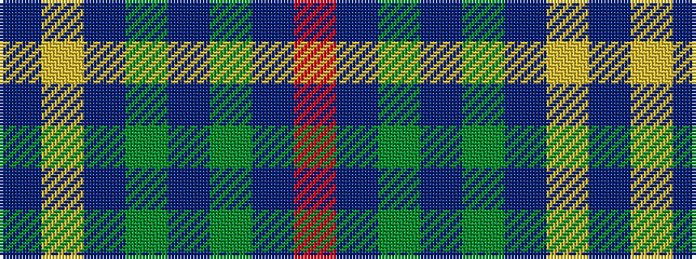

BYBGBGBR

It is a 8 stripe tartan.

<figure class="pat-woven">

<figcaption>idealised sample</figcaption>
</figure>

## Colour Sequence



## Tartans with this colour sequence

| Tartans |
|---------------|
| [Leighton (Personal)](/setts/s8/dr20lo4dr20g35do20dy16dr28r8/)|
||
| [Leighton (Personal)](/setts/s8/dr5lo1dr5g9do5dy4dr7r2~x4/)|
||
