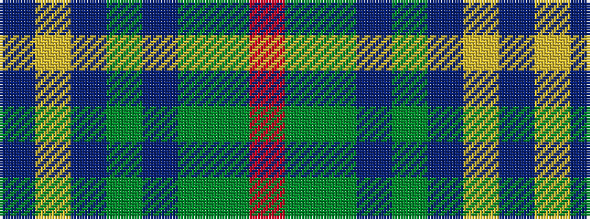

BYBGBGGR

It is a 8 stripe tartan.

<figure class="pat-woven">

<figcaption>idealised sample</figcaption>
</figure>

## Colour Sequence



## Tartans with this colour sequence

| Tartans |
|---------------|
| [Heather Mead (Personal)](/setts/s8/m13dg16dgi4dp4dgi4dp34lo1dp1~x2/)|
||
