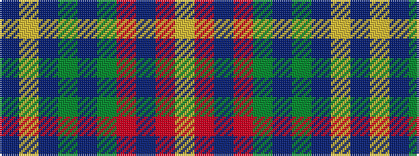

BYBGBGRBRY

It is a 10 stripe tartan.

<figure class="pat-woven">

<figcaption>idealised sample</figcaption>
</figure>

## Colour Sequence



## Tartans with this colour sequence

| Tartans |
|---------------|
| [Unidentified #64](/variants/s10/db57ly2db10dg4db4dg9r12db4r4lr2~x2/)|
||
