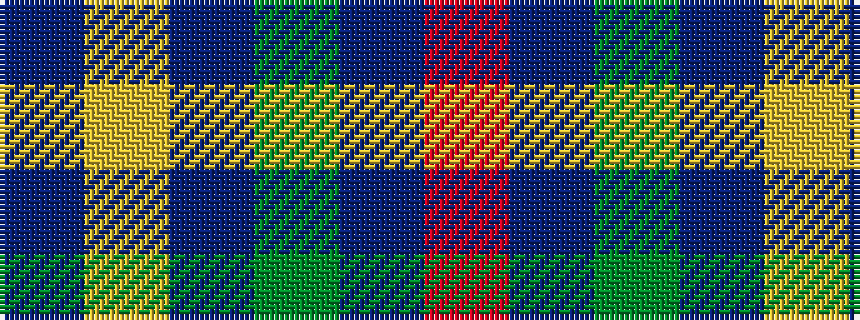

BYBGBR

It is a 6 stripe tartan.

<figure class="pat-woven">

<figcaption>idealised sample</figcaption>
</figure>

## Colour Sequence



## Tartans with this colour sequence

| Tartans |
|---------------|
| [Abertay University (Estimated threadcount)](/variants/s6/r5db15g3db15ly3db3~x2/)|
||
