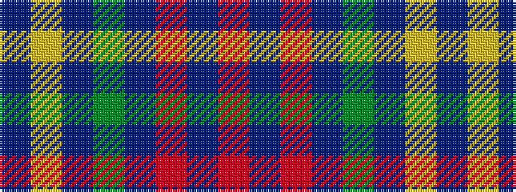

BYBGBRBR

It is a 8 stripe tartan.

<figure class="pat-woven">

<figcaption>idealised sample</figcaption>
</figure>

## Colour Sequence



## Tartans with this colour sequence

| Tartans |
|---------------|
| [Leighton](/variants/s8/dr20ly3dr20dg36dr20o16dr28r8/)|
||
