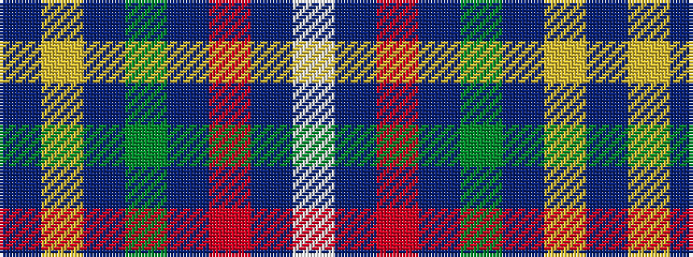

BYBGBRBW

It is a 8 stripe tartan.

<figure class="pat-woven">

<figcaption>idealised sample</figcaption>
</figure>

## Colour Sequence



## Tartans with this colour sequence

| Tartans |
|---------------|
| [Hodgkinson](/tartans/t5ly5db12g1db1r1db1w2/)|
||
