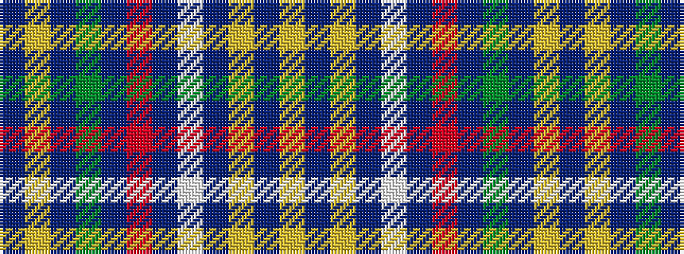

BYBGBRBWBYBY

It is a 12 stripe tartan.

<figure class="pat-woven">

<figcaption>idealised sample</figcaption>
</figure>

## Colour Sequence



## Tartans with this colour sequence

| Tartans |
|---------------|
| [O Savanao (District)](/variants/s12/ly7db5ly25db26lb4db4r3db4g4db26ly25db5~x2/)|
||
