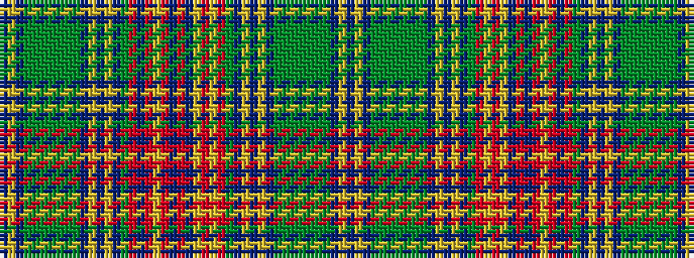

BYBGGGGGGGBYBYBGRBRYRBRBYRYRGBYBYBGGGGGGGBYB

It is a 44 stripe tartan.

<figure class="pat-woven">

<figcaption>idealised sample</figcaption>
</figure>

## Colour Sequence



## Tartans with this colour sequence

| Tartans |
|---------------|
| [New Brunswick or Beaverbrook District Tartan Tartan Number: 663. Earliest known date: 1959 The entry in the Lyon Court Books reads, "This tartan is assymetrical. The sett reading along the warp from the left may be divided into four equal sections of 190 threads. The first is symetrical, The second is assymetrical, The third is the same as the first, The fourth is the same as the second but in reverse" In reality the pattern is symetrical and has 380 threads in half sett as careful reading of Lord Lyons description reveals. The design was commissioned by Lord Beaverbrook and adopted by the Province. See products available Copyright © Blair Urquhart, Comrie, 2015](/setts/s44/t1ly1t1dg1g2dg2g2dg2g2dg1t1ly1t1ly1t1dg18r16ly1o2ly3t4r8dr9r3ly2r9dr5r6dg18t1ly1t1ly1t1dg1g2dg2g2dg2g2dg1t1ly1t1~x2/)|
|![New Brunswick or Beaverbrook District Tartan Tartan Number: 663. Earliest known date: 1959 The entry in the Lyon Court Books reads, "This tartan is assymetrical. The sett reading along the warp from the left may be divided into four equal sections of 190 threads. The first is symetrical, The second is assymetrical, The third is the same as the first, The fourth is the same as the second but in reverse" In reality the pattern is symetrical and has 380 threads in half sett as careful reading of Lord Lyons description reveals. The design was commissioned by Lord Beaverbrook and adopted by the Province. See products available Copyright © Blair Urquhart, Comrie, 2015 example sett](/setts/s44/t1ly1t1dg1g2dg2g2dg2g2dg1t1ly1t1ly1t1dg18r16ly1o2ly3t4r8dr9r3ly2r9dr5r6dg18t1ly1t1ly1t1dg1g2dg2g2dg2g2dg1t1ly1t1~x2/sett.png)|
