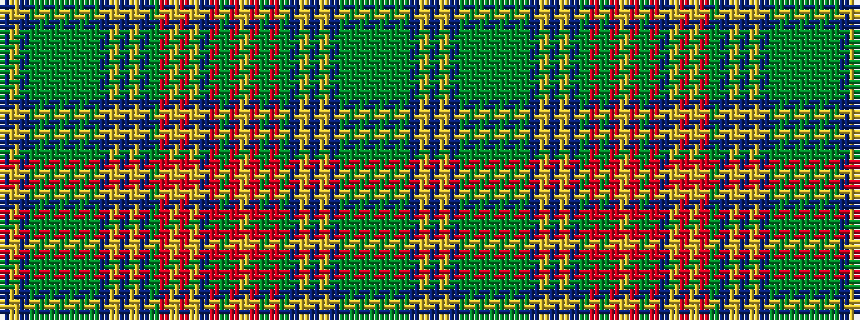

BYBGGGGGGGBYBYBGRGRYRGRBYRYRGBYBYBGGGGGGGBYB

It is a 44 stripe tartan.

<figure class="pat-woven">

<figcaption>idealised sample</figcaption>
</figure>

## Colour Sequence



## Tartans with this colour sequence

| Tartans |
|---------------|
| [New Brunswick](/setts/s44/t1ly1t1gi1g2gi2g2gi2g2gi1t1ly1t1ly1t1gi28r24ly1o2ly3t4r10dy16r4ly2r15dy5r9gi28t1ly1t1ly1t1gi1g2gi2g2gi2g2gi1t1ly1t1~x2/)|
||
