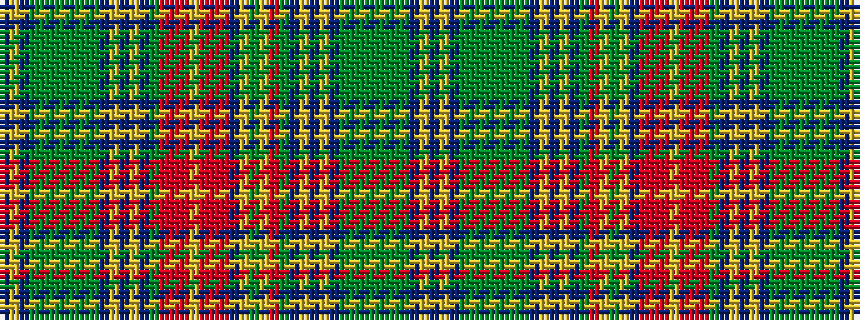

BYBGGGGGGGBYBYBGRRRYRRRBYGYRGBYBYBGGGGGGGBYB

It is a 44 stripe tartan.

<figure class="pat-woven">

<figcaption>idealised sample</figcaption>
</figure>

## Colour Sequence



## Tartans with this colour sequence

| Tartans |
|---------------|
| [New Brunswick, or Beaverbrook](/setts/s44/t1ly1t1dg1g2dg2g2dg2g2dg1t1ly1t1ly1t1dg18r16ly1y2ly3t4r8o9r3ly2r9o5r6dg18t1ly1t1ly1t1dg1g2dg2g2dg2g2dg1t1ly1t1~x2/)|
||
