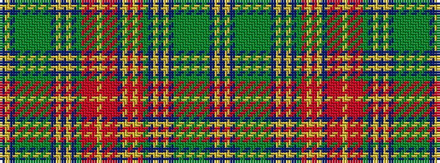

BYBGGGGGGGBYBYBGRRRYRRRBYRYRGBYBYBGGGGGGGBYB

It is a 44 stripe tartan.

<figure class="pat-woven">

<figcaption>idealised sample</figcaption>
</figure>

## Colour Sequence



## Tartans with this colour sequence

| Tartans |
|---------------|
| [New Brunswick (Lyon Court Books)](/variants/s44/t1ly1t1dg1g2dg2g2dg2g2dg1t1ly1t1ly1t1dg28r24ly1o2ly3t4r10oi16r4ly2r15oi5r9dg28t1ly1t1ly1t1dg1g2dg2g2dg2g2dg1t1ly1t1~x2/)|
||
