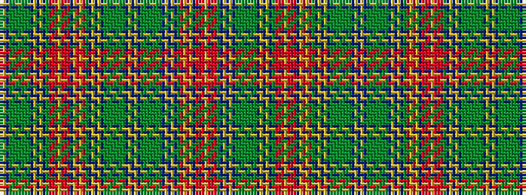

BYBGGGGGGGBYBYBGRRRYRRRBYRYRGBYBYBGGGGGGGBYBYBGGGGGGGBYBYBGRYRYBRRRYRRRGBYBYBGGGG

It is a 81 stripe tartan.

<figure class="pat-woven">

<figcaption>idealised sample</figcaption>
</figure>

## Colour Sequence



## Tartans with this colour sequence

| Tartans |
|---------------|
| [Beaverbrook (District)](/setts/s81/g2dg2g2dg1t1ly1t1ly1t1dg18r6o5r9ly2r3o9r8t4ly3o2ly1r16dg18t1ly1t1ly1t1dg1g2dg2g2dg2g2dg1t1ly1t1ly1t1dg1g2dg2g2dg2g2dg1t1ly1t1ly1t1dg18r16ly1o2ly3t4r8o9r3ly2r9o5r6dg18t1ly1t1ly1t1dg1g2dg2g2dg2g2dg1t1ly-h78260ea0cf86f5d2/)|
||
